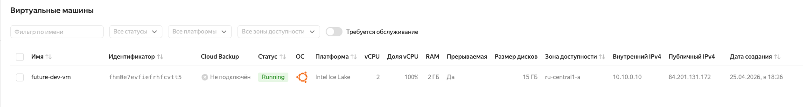
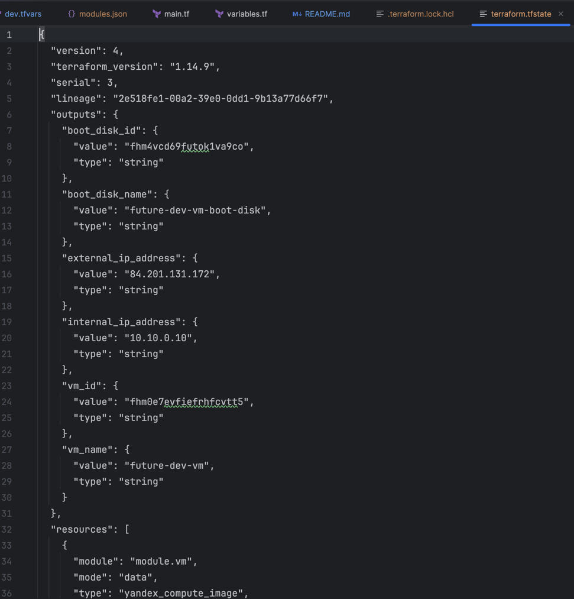

# Задание 1: модульная инфраструктура Terraform

Проект использует:

- переиспользуемый модуль `modules/vm`;
- общий root-слой в `root/`;
- окружения `dev`, `stage`, `prod`;

## Что создается

- загрузочный диск из образа Ubuntu;
- виртуальная машина Yandex Compute Cloud;
- сетевой интерфейс в переданной подсети;
- SSH-доступ через переданный публичный ключ;
- outputs с ID, именем, IP-адресами VM и ID/именем диска.

## Инструкция

Шаг 1. Заполните значения в `envs/*/*.tfvars`:
   - `cloud_id`
   - `folder_id`
   - `subnet_id`
   - `vm_name`
   - `hostname`
   - `ssh_public_key`

Шаг 2. Укажите токен:

```bash
export YC_TOKEN="<токен>"
```

Шаг 3. Запуск для конкретного окружения из `Task1Advanced/root`.

### Dev

```bash
cd Task1Advanced/root
terraform init
terraform plan -state=../envs/dev/terraform.tfstate -var-file=../envs/dev/dev.tfvars
terraform apply -state=../envs/dev/terraform.tfstate -var-file=../envs/dev/dev.tfvars
```

### Stage

```bash
cd Task1Advanced/root
terraform init
terraform plan -state=../envs/stage/terraform.tfstate -var-file=../envs/stage/stage.tfvars
terraform apply -state=../envs/stage/terraform.tfstate -var-file=../envs/stage/stage.tfvars
```

### Prod

```bash
cd Task1Advanced/root
terraform init
terraform plan -state=../envs/prod/terraform.tfstate -var-file=../envs/prod/prod.tfvars
terraform apply -state=../envs/prod/terraform.tfstate -var-file=../envs/prod/prod.tfvars
```

## Параметры

### Обязательные

| Переменная       | Описание                                  |
|------------------|-------------------------------------------|
| `cloud_id`       | ID облака Yandex Cloud                    |
| `folder_id`      | ID каталога Yandex Cloud                  |
| `subnet_id`      | ID подсети для сетевого интерфейса VM     |
| `zone`           | Зона Yandex Cloud                         |
| `vm_name`        | Имя VM и префикс имени загрузочного диска |
| `hostname`       | Hostname VM                               |
| `cores`          | Количество vCPU                           |
| `memory`         | Объем RAM в GB                            |
| `disk_size`      | Размер загрузочного диска в GB            |
| `ssh_public_key` | Публичный SSH-ключ                        |

### Опциональные

| Переменная     | Дефолт            | Описание                                |
|----------------|-------------------|-----------------------------------------|
| `disk_type`    | `network-ssd`     | Тип диска                               |
| `image_family` | `ubuntu-2204-lts` | Семейство образа для загрузочного диска |
| `platform_id`  | `standard-v3`     | Платформа Yandex Compute Cloud          |
| `enable_nat`   | `true`            | Назначать ли публичный IP через NAT     |
| `ssh_user`     | `ubuntu`          | Linux-пользователь для SSH              |
| `preemptible`  | `true`            | Создавать ли прерываемую VM             |


## Outputs

| Output                | Описание                              |
|-----------------------|---------------------------------------|
| `vm_id`               | ID созданной виртуальной машины       |
| `vm_name`             | Имя созданной виртуальной машины      |
| `internal_ip_address` | Внутренний IP-адрес VM                |
| `external_ip_address` | Внешний IP-адрес VM, если включен NAT |
| `boot_disk_id`        | ID загрузочного диска                 |
| `boot_disk_name`      | Имя загрузочного диска                |

## Запуск

Результат запуска для dev:



