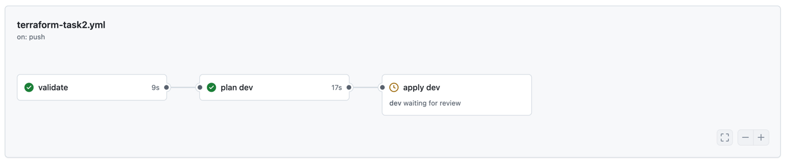
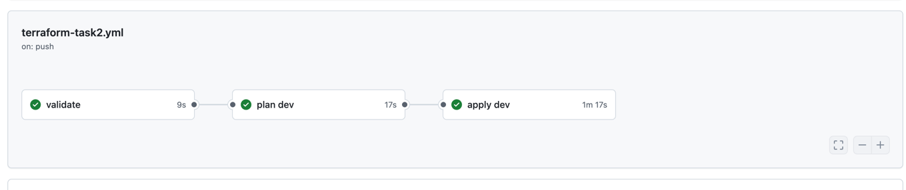
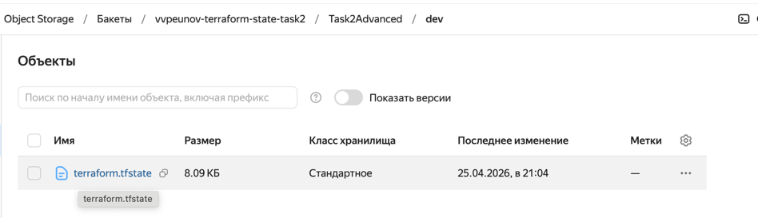
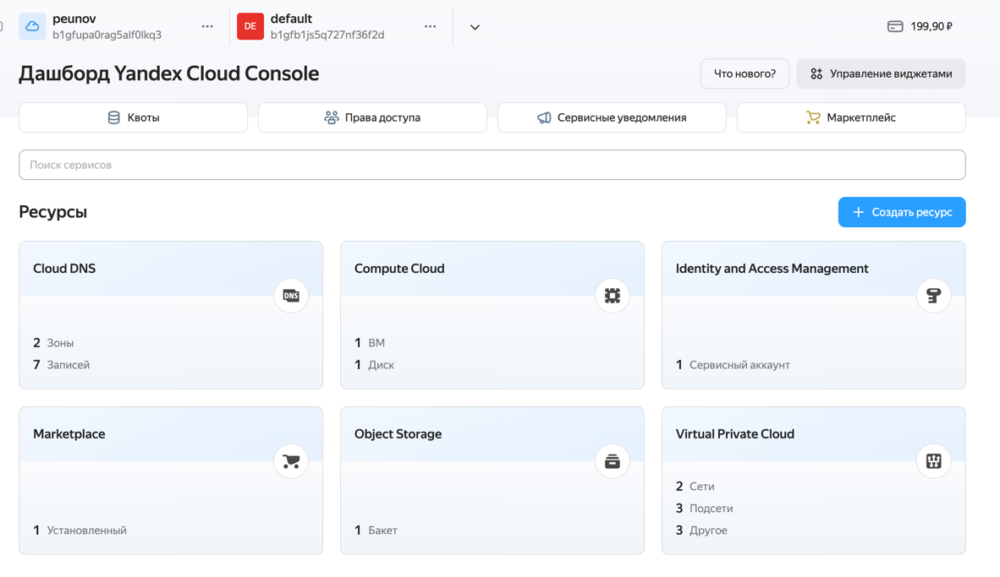
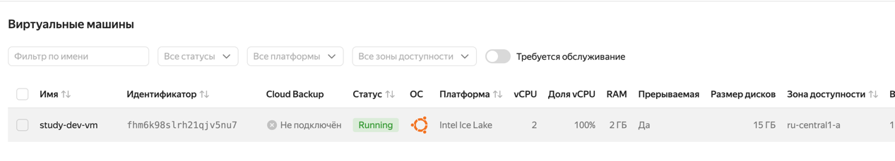

# Задание 2: CI/CD и удаленное хранение Terraform state

Код инфраструктуры остался тем же, что и в задании 1 по смыслу: VM создается через Terraform-модуль. 
В этом задании добавлены две важные вещи: удаленный state в Yandex Object Storage и запуск Terraform 
через GitHub Actions.

## Реализованные скрипты

### GitHub actions (`.github/workflows/terraform-task2.yml`)

Workflow для проверки, планирования и применения Terraform.

На push в любую ветку он делает `fmt`, `validate` и `plan` для окружения `dev`,
если изменились файлы задания или сам workflow.

`apply` запускается после `plan` для `dev` и проходит через GitHub Environment `dev`.
Ручное подтверждение настраивается в protection rules этого environment.

### S3 backend (`root/backend.tf`)

Здесь настойка S3 backend. Конкретный bucket не лежит в коде,
он передается в `terraform init` из GitHub Secret `TF_STATE_BUCKET`.

## Итоги запуска

Ждёт апрув: 

После апрува: 

Конфигурация в s3:

Созданные сущности:

VM:

