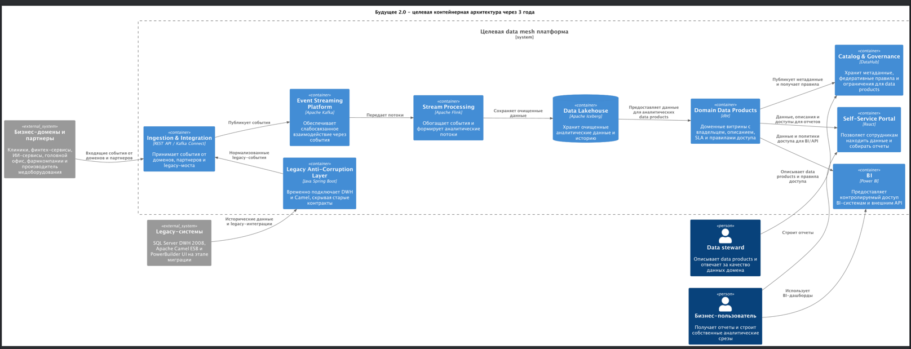
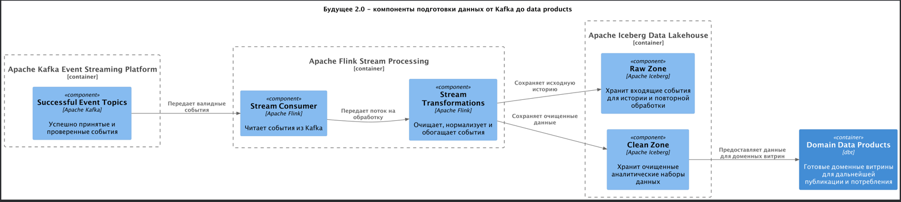
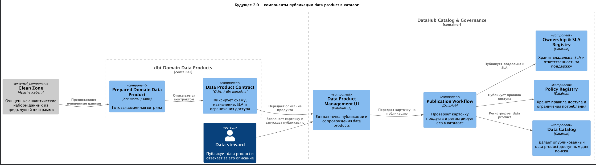
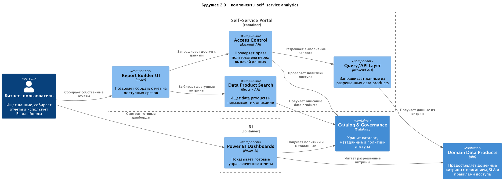

# Задание 3. Проектирование целевой архитектуры и оценка рисков внедрения

Спроектируйте целевую архитектуру системы «Будущего 2.0» в горизонте трёх лет, используя C4-модель на
уровне контейнеров и компонентов. Покажите, как изменятся ключевые системы компании при масштабировании,
включая появление новых бизнес-направлений, интеграцию дополнительных источников данных и отказ от легаси-систем.

## Целевая архитектура

### Диаграмма контейнеров 
[Исходник](containers.puml)

### Диаграммы компонентов

- **Ingestion & Event Streaming** - подключение доменов, партнеров и legacy-систем через события.
[Исходник](01-components.puml)

- **Kafka to Data Products** - путь от Kafka до готового domain data product.
[Исходник](02-components.puml)

- **Data Products & Governance** - публикация data product в каталог и правила доступа.
[Исходник](03-components.puml)

- **Self-Service Analytics** - портал самообслуживания, BI-доступ и проверка прав пользователей.
[Исходник](04-components.puml)

## Карта рисков трансформации

| Описание риска                                                                                                                                                                             | Тип             | Вероятность возникновения | Потенциальное влияние на бизнес | План по управлению                                                                                                                                                                                                                                                                                                         |
|--------------------------------------------------------------------------------------------------------------------------------------------------------------------------------------------|-----------------|---------------------------|---------------------------------|----------------------------------------------------------------------------------------------------------------------------------------------------------------------------------------------------------------------------------------------------------------------------------------------------------------------------|
| Legacy DWH и Apache Camel останутся на критическом пути дольше запланированного, из-за чего новая платформа будет зависеть от старых контрактов и бизнес-логики SQL Server 2008.           | Архитектурные   | Высокая                   | Высокое                         | Технически: развивать Legacy Anti-Corruption Layer, переводить legacy-записи в доменные события, фиксировать план отключения интеграций через DWH/Camel по доменам. Управленчески: назначить владельцев миграции в каждом домене и контролировать сроки вывода legacy из критических процессов.                            |
| Домены начнут публиковать события и data products без единых контрактов, SLA и правил владения, что приведет к несовместимости данных и росту ручных согласований.                         | Архитектурные   | Средняя                   | Высокое                         | Технически: использовать Schema Registry, Data Product Contract, каталог DataHub, проверки совместимости схем и обязательное описание владельца, SLA и ограничений доступа. Управленчески: ввести роль data steward в каждом домене и архитектурный review для новых data products.                                        |
| В аналитические контуры случайно попадут медицинские карты, истории болезни или результаты медицинских исследований, которые по условиям задачи не должны использоваться в витрине данных. | Технологические | Средняя                   | Высокое                         | Технически: настроить классификацию чувствительных данных, политики доступа в Catalog & Governance, валидацию входящих событий и блокировку запрещенных атрибутов на ingestion-слое. Управленчески: закрепить регламент обработки медицинских данных и проводить регулярные проверки соответствия требованиям регуляторов. |
| Потоковая платформа Kafka/Flink/Iceberg не выдержит роста числа доменов, партнеров и near-real-time сценариев, что ухудшит доступность отчетов и задержки обработки.                       | Технологические | Средняя                   | Высокое                         | Технически: проектировать Kafka topics, партиционирование, Flink jobs и Iceberg tables с учетом масштабирования, добавить мониторинг лагов, DLQ, нагрузочное тестирование и autoscaling в облаке. Управленчески: заранее согласовать SLO для критичных потоков и план capacity management.                                 |
| Качество исторических данных из SQL Server DWH окажется недостаточным для формирования доверенных доменных витрин после миграции.                                                          | Технологические | Высокая                   | Среднее                         | Технически: сохранять raw zone для повторной обработки, ввести проверки качества в stream/dbt transformations, сверки с источниками и правила очистки данных. Управленчески: согласовать с бизнесом допустимые расхождения, владельцев исправления данных и приоритеты очистки по ключевым отчетам.                        |
| Бизнес-пользователи продолжат строить отчеты в старых BI-процессах и обходить self-service портал, из-за чего целевая модель доступа и управления данными не будет работать полноценно.    | Организационные | Средняя                   | Среднее                         | Технически: интегрировать Power BI и портал только с опубликованными data products и политиками DataHub. Управленчески: провести обучение пользователей, перевести ключевые отчеты на новый портал поэтапно и ограничить создание новых отчетов напрямую поверх legacy DWH.                                                |
| Команды доменов не будут готовы отвечать за собственные data products, качество данных и SLA, что создаст зависимость от центральной команды данных.                                       | Организационные | Высокая                   | Высокое                         | Управленчески: закрепить модель data ownership, выделить data steward и технического владельца в каждом домене, ввести KPI по качеству данных и SLA. Технически: дать командам шаблоны dbt-моделей, контрактов и автоматические проверки публикации в каталог.                                                             |
| Ошибочные события или несовместимые изменения схем будут попадать в продуктивные потоки и ломать downstream-витрины.                                                                       | Технологические | Средняя                   | Среднее                         | Технически: использовать Schema Registry, backward/forward compatibility checks, Error Event Topics, повторную обработку и contract tests перед публикацией событий. Управленчески: внедрить процесс версионирования событий и согласования breaking changes между доменами.                                               |
| Расширение на новые регионы и подключение фармкомпаний/производителя медоборудования приведут к конфликтам регуляторных требований и правил доступа к данным.                              | Архитектурные   | Средняя                   | Высокое                         | Технически: хранить политики доступа и ограничения потребления в Catalog & Governance, разделять данные по доменам и регионам, применять атрибутные политики доступа. Управленчески: привлекать юридическую и compliance-функцию до подключения нового региона или партнера.                                               |
| Облачная миграция критичных данных создаст риски доступности, резервного копирования и восстановления при сбоях.                                                                           | Технологические | Средняя                   | Высокое                         | Технически: использовать отказоустойчивое развертывание, резервное копирование, disaster recovery, мониторинг и регулярные тесты восстановления для Kafka, Iceberg, DataHub и портала. Управленчески: согласовать RTO/RPO для критичных сервисов и проводить учения по аварийному восстановлению.                          |
